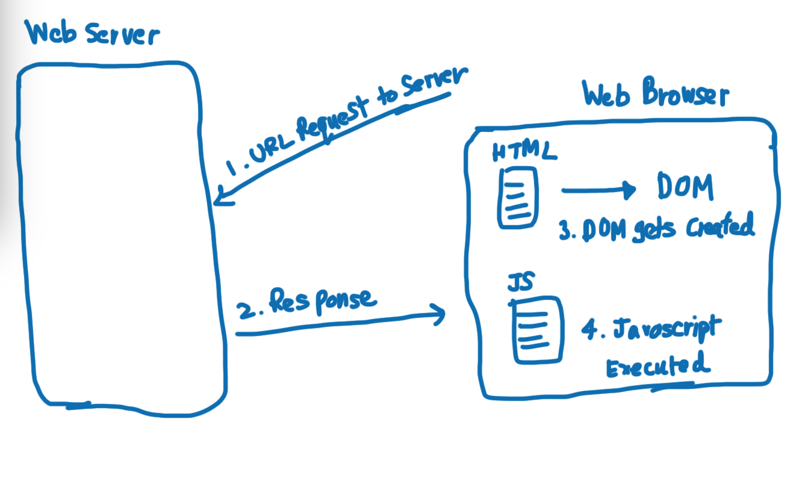
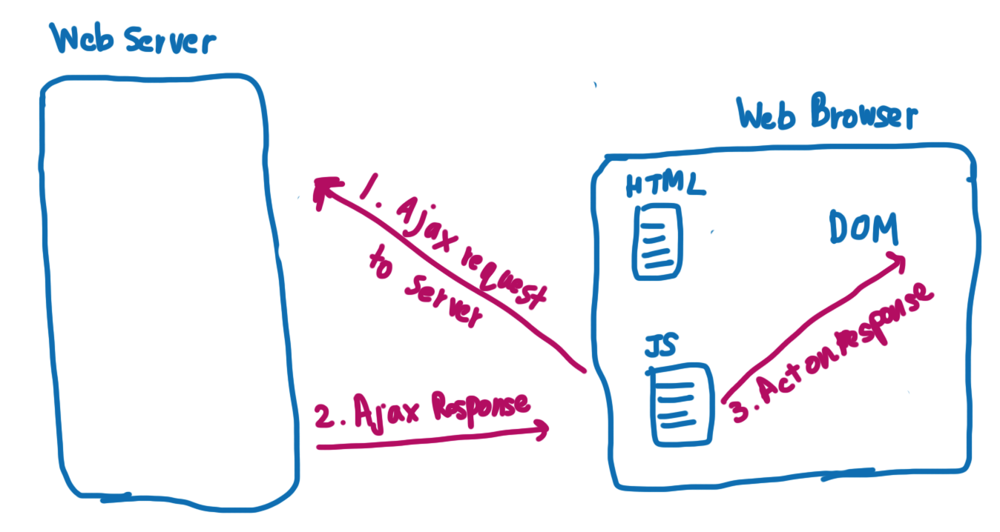

# Learning Competencies
- Learn what Ajax is and how it can be used
- Organize your jQuery and JavaScript
- Learn about how to send data to the server and work with JSON
- Learn about some handy utility methods including $.each and $.map while working with complicated JSON data 


# Overview

AJAX is a developer's dream, because you can:

- Update a web page without reloading the page
- Request data from a server - after the page has loaded
- Receive data from a server - after the page has loaded
- Send data to a server - in the background

AJAX is not a programming language. AJAX is a technique for accessing web servers from a web page. AJAX stands for Asynchronous JavaScript And XML.

## Typical Browser Web Request




## Ajax Request



For example. A normal jQuery code to book flight ticket would look like this

```javascript
$('.cofirmation').on('click', 'button', function(){
	$(this).find('.ticket').slideDown();
});

$('.confirmation .view-boarding-pass').on('click', function() {
	$(this).closest('.ticket').find('img').show();
});
```
Now we want to this jQuery call to turn into Ajax Call we would use something called Ajax Methods

`$.ajax(url[, settings])`

For example.

```javascript
('.cofimation').on('click', 'button', function(){
	$.ajax('http://example.org/confirmation.html',
	  success: function(response) {
		  $('.ticket').html(response).slideDown();
	  }
   });
});
```

### Respose HTML to AJAX call:

```html
<div> ...
	<strong>Boarding Pass:   </strong>
	<a href='#' class='view-boarding-pass'>View Boarding Pass</a>
	
</div>
```

Now `response` attribute has the block of `html` code which is returned from server

You can also simplify the URL link by mentioning relative domain name i.e. `confirmation.html`

For example.

```javascript
('.cofimation').on('click', 'button', function(){
	$.ajax('confirmation.html',
	  success: function(response) {
		  $('.ticket').html(response).slideDown();
	  }
   });
});
```

You can use `Chrome DevTools` to see the AJAX responses.

An equivalent short call of above function is: 

```javascript
$.get('confirmation.html', function(response) {
	$('.ticket').html(response).slideDown();
});
```

### Sending Parameter with requests

```javascript
$.ajax('confirmation.html?confNum=1234', {
	success: function(response) {
		$('.ticket').html(response).slideDown();
	}
});
```

is equivalent to below

```javascript
$.ajax('confirmation.html', { success: function(response) {
	$('.ticket').html(response).slideDown();
	},
	data: { "confNum": 1234 }
});
```

Also, the other way to get confirmation number is to store that inside of HTML tag

```html
<div class='ticket' data-confNum='1234'>
```

```javascript
$.ajax('confirmation.html', {
	success: function(response) {
		$('.ticket').html(response).slideDown();
	},
	data: { "confNum": $(".ticket").data("confNum") }
});
```

This above code will still result in same URL `confirmation.html?confNum=1234`


## Handling failed AJAX requests

Whenever you execute a AJAX request if it successfully executes, you'll get a success response but what will happen if in case request time-out or server error. We have to handle such conditions. For this we also specify an error callback.

```javascript
$('confirmation').on('click', 'button', function() { 
	$.ajax('confirmation.html', {
		success: function(response) {
			$('.ticket').html(response).slideDown();
		},
		error: function(request, errorType, errorMessage) {
			alert('Error: ' + errorType + ' with message: ' + errorMessage);
		},
		timeout: 3000,
		beforeSend: function() { 
			// This gets called of before the AJAX request gets fired off
			// So you can add spiners so users gets to know request is being processed
			$('.confirmation').addClass('is-loading');
		},
		complete: function() {
			// runs after both success and error callbacks
			$('.cofirmation').removeClass('is-loading'); 
		}
	});
});
```

Question. How long AJAX request waits for Time-out? 

Ans. Every browser is different which is why we have to specify the time-out option ourself


`http://example.org/confirmation.html`: Our AJAX response

```html
<div> ...
	<strong>Boarding Pass: </strong>
	<a href= '#' class='view-boarding-pass'>View Boarding Pass</a>
	
</div>
```

```javascript
$('.confirmation .view-boarding-pass').on('click', function() { .... });
```

This above code was run once when the page loaded. But when the page loaded `.view-boarding-pass` didn't exist. It only existed after our AJAX request. To fix the above thing we will use 

### Event Delegation

```javascript
$('.confimation').on('click', '.view-boarding-pass', function() { .... });
```

## Use Javascript Objects to Organize jQuery code

```javascript
$(document).ready(function() {
	$('.cofirmation').on('click', 'button', function() {
		$.ajax('.cofirmation.html', {
			timeout: 3000,
			success: function(response) { $('.ticket').html(response).slideDown(); },
			error: function(request, errorType, errorMessage) {
				alert('Error: ' + errorType + ' with message: ' + errorMessage);
			},
			beforeSend: function() { $('.confirmation').addClass('is-loading');},
			complete: function() { $('.confirmation').removeClass('is-loading'); }
		});
	});
	$('.confirmation').on('click', '.view-boarding-pass', function(event) {
		event.preventDefault();
		$('.view-boarding-pass').hide();
		$('.boarding-pass').show();
	});
});
```

> Refactoring above code

```javascript
var confirmation = {
	init: function() {
		$('.cofirmation').on('click', 'button', function() {
		$.ajax('.cofirmation.html', {
			timeout: 3000,
			success: function(response) { $('.ticket').html(response).slideDown(); },
			error: function(request, errorType, errorMessage) {
				alert('Error: ' + errorType + ' with message: ' + errorMessage);
			},
			beforeSend: function() { $('.confirmation').addClass('is-loading');},
			complete: function() { $('.confirmation').removeClass('is-loading'); }
			});
		});

		$('.confirmation').on('click', '.view-boarding-pass', function(event) {
			event.preventDefault();
			$('.view-boarding-pass').hide();
			$('.boarding-pass').show();
		});
	}
}

$(document).ready(function() {
	confirmation.init(); 
});
```

> Furthur refactoring the above code: Pull out callbacks from event handlers & give it it's own key

```javascript
var confirmation = {
	init: function() {
		$('.cofirmation').on('click', 'button',  this.loadConfirmation);
		$('.confirmation').on('click', '.view-boarding-pass', this.showBoardingPass); 
	},
	loadConfirmation: function() {
		$.ajax('.cofirmation.html', {
			timeout: 3000,
			success: function(response) { $('.ticket').html(response).slideDown(); },
			error: function(request, errorType, errorMessage) {
				alert('Error: ' + errorType + ' with message: ' + errorMessage);
			},
			beforeSend: function() { $('.confirmation').addClass('is-loading');},
			complete: function() { $('.confirmation').removeClass('is-loading'); }
			});
	},
	showBoardingPass: function(event) {
			event.preventDefault();
			$('.view-boarding-pass').hide();
			$('.boarding-pass').show();
	};
}

$(document).ready(function() {
	confirmation.init(); 
});
```

> NOTE: use `this` keyword whenever calling any callback. To refer to same callback

## Javascript Functions: 

> Javascript objects are great for organising our code. However this is limited to one confirmation per page. So, we rather use function to encapsulate our code

```javascript 
// Object
var vacation = {
	init: function() {
		// init vacation
	}
};

$(document).ready(functino() {
	vacation.init();
});
```

```javascript
// Function with multiple calls
function Vacation(destination) {
	// init vacation to destination
}

$(document).ready(function() {
	var paris = new Vacation('Paris');
	var london = new Vacation('London');
});
```


For example. we can also use browser login to confirm this 

```javascript
function Vacation(destination) {
	this.details = function() {
		console.log(destination);
	}
}

$(document).ready(function()) {
	var paris = new Vacation('Paris');
	paris.details();

	var london = new Vacation('London');
	london.details();
});
```

> Let's move this Object into a Reusable Function

```javascript
var confirmation = {
	init: function() {
		$('.confirmation').on('click', 'button', this.loadConfirmation);
		$('.confirmation').on('click', '.view-boarding-pass', this.showBoardingPass);
	},
	loadConfirmation: function() { ... }
	showBoardingPass: function(event) { ... }
};

$(document).ready(function() {
	confirmation.init();
});
```

### Refactoring to Functions
```javascript
function Confirmation(el) {  // el here refers to this jQuery object
	this.el = el;  // save reference to this passing object
	// helper methods go here
	// event handler go here
}

$(document).ready(function() {
	var paris = new Confirmation($('#paris'));
	var london = new Cofirmation($('#london'));
});
```

For example.

```javascript
function Confirmation(el) {  // el here refers to this jQuery object
	this.el = el;  // save reference to this passing object
	
	this.loadConfirmation = function() { ... }
	this.showBoardingPass = function(event) { ... }

	this.el.on('click', 'button', this.loadConfirmation);
	this.el.on('click', '.view-boarding-pass', this.showBoardingPass);
}

$(document).ready(function() {
	var paris = new Confirmation($('#paris'));
	var london = new Cofirmation($('#london'));
});
```

## AJAX Forms & using JSON

> AJAX with post

application.js
```javascript
$('form').on('submit', function(event){
	event.preventDefault(); // default behaviour is make AJAX call & submit the page. But we don't want to submit the page so use this method
	$.ajax('/book', {
		type: 'POST'
	});
});
```

index.html

```html
<form action='/book'>
	<select id='destination' name='destination'>
	...
	</select>
	<input type='text' id='quantity' name='quantity' value='1' />
</form>
```

> To grab data out of form in jQuery

```javascript
$('form').on('submit', function(event) {
	event.preventDefault();
	$.ajax('/book'), {
		type: 'POST',
		data: { "destination": $('#destination').val(),
				"quantity": $('#quantity').val() }
	});
});
```

> Refactor: jQuery has shorter way to put out data i.e. serialize

```javascript
$('form').on('submit', function(event) {
	event.preventDefault();
	$.ajax('/book'), {
		type: 'POST',
		data: $('form').serialize(),
		success: function() {
			$('form').remove();
			$('#vacation').hide().html(result).fadeIn();
		}
	});
});
```

> Refactor above code

```javascript
$('form').on('submit', function(event) {
	event.preventDefault();
	var form = $(this); 
	$.ajax('/book'), {
		type: 'POST',
		data: form.serialize(),
		success: function() {
			form.remove();
			$('#vacation').hide().html(result).fadeIn();
		}
	});
});
```

## AJAX with JSON

Until now we have been getting HTML from our server. However what if the response was JSON?

```javascript
var form = $(this);
$.ajax('/book', {
	type: 'POST',
	data: form.serialize(),
	dataTypes: 'json',
	success: function(result) {
		form.remove();
		$('#vacation').hide().html(result).fadeIn();
	},
	contentType: 'application/json'
});
```

> Reading the JSON results and creating HTML
```javascript
success: function(result) {
	form.remove();
	var msg = $("<p></p>");
	msg.append("Destination: " + result.location + ". ");
	msg.append("Price: " + result.totalPrice + ". ");
	msg.append("Nights: " + result.nights + ". ");
	msg.append("Confirmation: " + result.confirmation + ". ");
	$('#vacation').hide().html().fadeIn();

}
```

# Exploration
- [Learn AJAX](https://learn.jquery.com/ajax/)
- [jQuery website for AJAX](https://api.jquery.com/jQuery.ajax/)
- [jQuery AJAX Introduction by w3School](https://www.w3schools.com/jquery/ajax_ajax.asp)
- [How to Use jQuery’s $.ajax() Function](https://www.sitepoint.com/use-jquerys-ajax-function/)
- [jQuery website for AJAX API list](https://api.jquery.com/category/ajax/)
